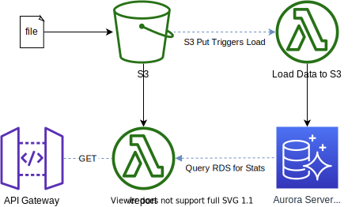

# research

- [research](#research)
  - [Architecture](#architecture)
    - [Challenges](#challenges)
    - [Assumptions](#assumptions)
    - [Serverless + Cloud Native (RDS vs S3 Select vs Athena vs DynamoDB NoSQL)](#serverless--cloud-native-rds-vs-s3-select-vs-athena-vs-dynamodb-nosql)
      - [S3-Select vs Athena](#s3-select-vs-athena)
      - [S3-Select Limitations](#s3-select-limitations)
      - [S3-Select Costs](#s3-select-costs)

## Architecture

### Challenges

- After extended testing S3-Select does not have the following abilities
  - to calculate the frequency of fields
  - nor does it have the ability to select the aggregate max of a date time
  - additionally, the file is too large to query in the s3 console meaning that testing of the syntax was conducted used boto3 on the local machine
- Converting the string to a datetime was a challenge that was solved `TO_TIMESTAMP(lastseen, 'y-MM-dd H:mm:ssXXX')`.

As a result of these challenges the next pivot is to try using Athena, which has complex query capabilities, however it requires defining a schema upfront.

- Athena
  - Athena and the Glue addons appear to be more complex, and querying a zipped datasource is more complicated
  - After loading to Athena it is corrupting the data count(*) returns 2,352,861 rows (this is wrong, bc `wc -l <filename.csv>` on the uncompressed csv is only 2,145,470) 

Given that Athena is corrupting the data, I must again pivot. The two remaining options are to store the data in a dynamodb table, and some sort of RDS (technically Aurora Serverless is offered under RDS). If RDS is required then aurora serverless is pretty awesome, however it adds complexity in how the db can be queried, as you can only query via the api. According to this StackOverflow, loading directly from s3 to aurora serverless is not supported [https://stackoverflow.com/questions/58357429/load-csv-from-s3-into-aws-rds-aurora-mysql-serverless](https://stackoverflow.com/questions/58357429/load-csv-from-s3-into-aws-rds-aurora-mysql-serverless).

Aurora Serverless
- [https://aws.amazon.com/blogs/database/using-the-data-api-to-interact-with-an-amazon-aurora-serverless-mysql-database/](https://aws.amazon.com/blogs/database/using-the-data-api-to-interact-with-an-amazon-aurora-serverless-mysql-database/)

### Assumptions

- For the purposes of the project the following will be assumed
  - API and infra will be shortlived (POC) and not live past the 1hr discussion window
    - As such api tokens will not be generated, and api will be accessible to the public internet
    - WAF will not be needed
    - Swagger aka OpenAPI although very nice to have is not needed
    - Caching of query results to save on data access costs, and speed of results, is not needed
    - Because a POC do not need multiple environments (Staging, Production)
  - Only a single file needs to be queried at a given time
    - Therefore can use S3-Select without appending to a massive csv compressed file
    - Avoids need to stage data in a DB SQL, or NoSQL, or query with Athena
    - Do not need to add ability to aggregate summary statistics over different time periods as one file is one month and it is assumed that only one file will be loaded

### Serverless + Cloud Native (RDS vs S3 Select vs Athena vs DynamoDB NoSQL)

Given that the assignment is looking only for summary metrics, and it is unclear whether or not more than one file needs to be loaded ever, I can therefore explore the use of a serverless cloud native service like s3-select or athena to directly query the data in the s3 bucket. Such an architecture would be simpler as it would remove the need for a database and the need to ETL the compressed csv data. Further given, that Bhaarat mentioned that Raft does not just do what is asked, but thinks of solutions and proposes the best solutions for a given challenge, this is likely in-line with what the challenge is looking for. There would also need to be a cost analysis of such a solution compared to the costs of running an rds database to house the same data. Additional considerations would be query performance, and any additional use cases. Additionally, to be completely serverless, and likely more cost effective, dynamodb NoSQL should also be considered if S3 Select or Athena do not meet the requirements. A benefit of S3 select or Athena is that it is also queried using a SQL syntax, which may be easier to maintain. A potential benefit of NoSQL is data schema's change rapidly overtime, and changes to the csv would likely break the RDS schema, and require additional edits to the DB schema.

#### S3-Select vs Athena

"You may ask: if S3 is so easy to use, why do we need Athena to query a data lake? Here are the main differences between those two:

- Athena can query multiple objects at once, while with S3 select, we can only query a single object (ex. a single flat file)
- With Athena, we can encapsulate complex business logic using ANSI-compliant SQL queries, while S3-select lets you perform only basic queries to filter out data before loading it from S3.
- Athena supports more file formats and more forms of file compression than S3-Select. For instance, S3-select supports only CSV, JSON, and Parquet, while Athena additionally allows TSV, ORC files, and more.
- S3-select works only with the S3 API (ex. by using Python boto3 SDK), while Athena can be queried directly from the management console or SQL clients via JDBC.
(Athena allows many optimization techniques for better performance and cost-optimization, such as partitioning, columnar storage, while S3-select is a very rudimentary query that just nothing but filtering data.
- S3-select can be queried directly, while Athena requires the definition of a schema."

Source [https://towardsdatascience.com/how-i-improved-performance-retrieving-big-data-with-s3-select-2bd2850bc428](https://towardsdatascience.com/how-i-improved-performance-retrieving-big-data-with-s3-select-2bd2850bc428)

#### S3-Select Limitations

- S3 Glacier Select does not support aggregate functions. [https://docs.aws.amazon.com/AmazonS3/latest/userguide/s3-glacier-select-sql-reference-aggregate.html](https://docs.aws.amazon.com/AmazonS3/latest/userguide/s3-glacier-select-sql-reference-aggregate.html)

#### S3-Select Costs

|                                                                                                 |                             |
| ----------------------------------------------------------------------------------------------- | --------------------------- |
| Data Returned by S3 Select                                                                      | \$0.0007 per GB             |
| Data Scanned by S3 Select                                                                       | \$0.002 per GB              |
| PUT, COPY, POST, or LIST Requests                                                               | \$0.005 per 1,000 requests  |
| GET, SELECT and all other Requests                                                              | \$0.0004 per 1,000 requests |
| Lifecycle Transition Requests into Standard – Infrequent Access or One Zone – Infrequent Access | \$0.01 per 1,000 requests   |

Source [https://www.apptio.com/blog/how-aws-s3-pricing-works/](https://www.apptio.com/blog/how-aws-s3-pricing-works/)